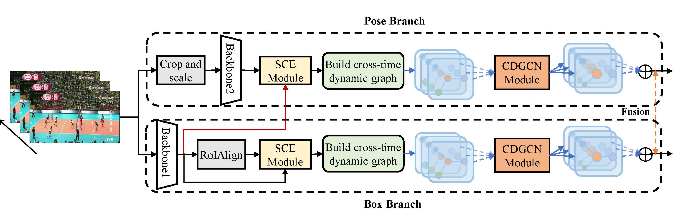

# Posed Mixed Dynamic Graph Convolution Network for Group Activity Recognition

This is an official implementation of *Posed Mixed Dynamic Graph Convolution Network for Group Activity Recognition*, namely shelterX's Degree M.S. Thesis. In this repo, we open the PyTorch-based codebase corresponding to training and inference as described in the Thesis. The overall architecture of PDGCN is shown as below.



## Dependencies

- OS: Linux (CentOS 7)
- GPU: NVIDIA Tesla V100
- Python: `3.7`
- CUDA: `10.2`
- PyTorch: `1.10`
- Torchvision: `0.11.2`
- [RoIAlign for Pytorch](https://github.com/longcw/RoIAlign.pytorch)

## Datasets Preparation

### Download Videos and tracklets

- Option one
The steps following refer to the DIN official reop [https://github.com/JacobYuan7/DIN-Group-Activity-Recognition-Benchmark](https://github.com/JacobYuan7/DIN-Group-Activity-Recognition-Benchmark).

    1. Download publicly available datasets from following links: [Volleyball dataset](http://vml.cs.sfu.ca/wp-content/uploads/volleyballdataset/volleyball.zip) and [Collective Activity dataset](http://vhosts.eecs.umich.edu/vision//ActivityDataset.zip).
    2. Unzip the dataset file into `data/volleyball` or `data/collective`.
    3. Download the file `tracks_normalized.pkl` from [cvlab-epfl/social-scene-understanding](https://raw.githubusercontent.com/wjchaoGit/Group-Activity-Recognition/master/data/volleyball/tracks_normalized.pkl) and put it into `data/volleyball/videos`

- Option two:
For the convenience of reproducibility in the Thesis, you can refer the repo below to prepare the using datasets more easily:
  - [Dataset Preparation](https://github.com/hongluzhou/composer#dataset-preparation)
  - Composer offical repo: [https://github.com/hongluzhou/composer](https://github.com/hongluzhou/composer)

### Extract Keypoints

You can refer to the following repo to extract keypoints of each frame using HRNet.

- [https://github.com/hongluzhou/hrnet_pose_extract](https://github.com/hongluzhou/hrnet_pose_extract)

Suppose you have prepared the data following above steps, your `volleyball` directory tree should be like this:

```shell
volleyball
├── joints
    ├──1
    ├──2
    ├──...
├── tracks_normalized.pkl
└── videos
    ├──seq01
    ├──seq02
    ├──...
```

And the `collective` directory tree looks as follows.

```shell
collective
├── joints
    ├──1
    ├──2
    ├──...
├── tracks_normalized.pkl
└── videos
    ├──seq01
    ├──seq02
    ├──...
```

## Get Started

Say you have changed the directory to the project rootpath `$PDGCN$`.

Firstly, you should change the `data_path` into yourself in `config.py`, as follows:

```python
self.data_path = '/path/to/your/data/volleyball' #data path for the volleyball dataset
self.data_path='/path/to/your/data/collective'  #data path for the collective dataset
```

Then, replace the dataset path `dataset_dir` in `collective.py` and `volleyball.py` with yours, respectively:

```python
dataset_dir = '/path/to/your/data/collective' # collective.py
dataset_dir = '/path/to/your/data/volleyball' # volleyball.py
```

1. **Train the Base Model**: Fine-tune the base model pretrained on ImageNet for two datasets.

    ```shell
    # Volleyball dataset
    
    python scripts/train_volleyball_stage1.py
    
    # Collective Activity dataset
     
    python scripts/train_collective_stage1.py
    ```

2. **Train with the PDGCN module**: Append PDGCN onto the base model to get a reasoning model.
    1. **Volleyball dataset**

        - **PDGCN**

        ```shell
        python scripts/train_volleyball_stage2_pdgcn.py
        ```

        Other model, such as ARG, start training with the scripts below:
       - **ARG**

        ```shell
        python scripts/train_volleyball_stage2_arg.py
        ```

    2. **Collective activity dataset**

        - **PDGCN**

        ```shell
        scripts/train_collective_stage2_pdgcn.py
        ```

## Citation

If you find our work or the repo useful and motivated to your study, please use the following BibTex entry for citation.

```bibTex
@mastersthesis{shelterX2023PDGCN,
  author       = {ShelterX},
  title        = {Posed Mixed Dynamic Graph Convolution Network for Group Activity Recognition},
  location     = {Wuhan},
  institution  = {Central China Normal University},
  year         = {2023}
}
```
